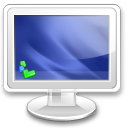
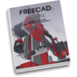

# FreeCAD documentation

This repository is an experiment to reconstruct the FreeCAD documentation currently hosted on a [Mediawiki](https://www.freecadweb.org/wiki) instance on freecadweb.org to a git-based system, that is decentralized and doesn't depend on a particular hosting platform anymore. The argumentation and explanations behind this experiment are on the [HELP.md](HELP.md) page.

## Introduction

This is the documentation wiki of [FreeCAD](https://www.freecadweb.org). You have two main ways to browse through the documentation: by exploring user hubs, or by following the manual. It is a work in progress, written by the community of users and developers of FreeCAD. If you find information that is wrong or missing, please [help FreeCAD](user-documentation/help-freecad.md)!

###  [User hub](user-documentation/README.md)

This section contains documentation useful for FreeCAD users in general: a list of all the workbenches, detailed instructions on how to install and use the FreeCAD application, tutorials, and all you need to get started.

### [Power users hub](poweruser-documentation/README.md)

This section gathers documentation for advanced users and people interested in writing python scripts. You will also find there a repository of macros, instructions on how to install and use them, and more information about customizing FreeCAD to your specific needs.

###  [Developers hub](developers-documentation/README.md)

This section contains material for developers: How to compile FreeCAD yourself, how the FreeCAD source code is structured and how to navigate in it, and how to develop new workbenches, or embed FreeCAD in your own application.

###  [Manual](manual/README.md)

The FreeCAD manual is another, more linear way to present the information contained in this wiki. It is made to be read like a book, and will gently introduce you to many other pages from the hubs above. ebook versions are also available, as well as a couple of translations in pdf format.

## Translations

The whole documentation is continuously being translated by users, and is available in several languages. See the contents of the [translations](translations/) folder for available languages.

## Get involved

### How to participate

There is plenty to do inside the FreeCAD project, if you are interested in helping us. Of course, there are programming tasks for C++ or Python programmers, but there are also many things you can do even if you cannot code, such as:

* writing documentation and editing the wiki
* helping newcomers
* translating the application and documentation
* helping with the packaging of the latest release of FreeCAD for your favourite operating system
* helping other people around you to discover FreeCAD. 

The [help FreeCAD](user-documentation/help-freecad.md) page describes it all with more details. Starting from 2016, FreeCAD also participates in the [Google Summer of Code](user-documentation/google-summer-of-code.md). The Contributors hub page is another effort to gather the possible ways to help and contribute to the FreeCAD project.

### Source code

FreeCAD can be compiled on all platforms using [CMake](https://cmake.org/). The source code is [LGPL](https://en.wikipedia.org/wiki/GNU_Lesser_General_Public_License)-licensed and hosted on [GitHub](https://github.com/FreeCAD/FreeCAD). There are build instructions for Windows, Unix/Linux and MacOSX. The source code documentation is hosted here, generated by Doxygen, and documented on the wiki.

### About the development

Check the Development roadmap for news about what is being planned, the Changelog and Roadmap pages on the FreeCAD tracker to see the progress towards next release, or the Project statistics for even more information about the FreeCAD codebase. All the development communication happens on the forum, so be sure to visit it if you are interested in participating. 