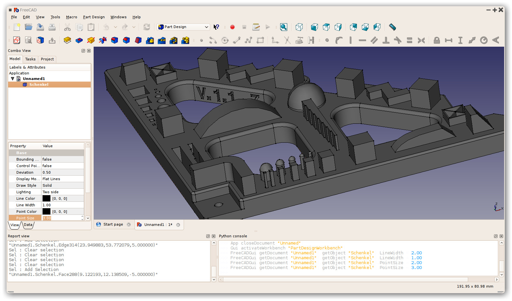

# About FreeCAD

FreeCAD is a general purpose parametric 3D [CAD](http://en.wikipedia.org/wiki/CAD) modeler. The development is completely [Open Source](http://en.wikipedia.org/wiki/Open_source) (LGPL License). FreeCAD is aimed directly at [mechanical engineering](http://en.wikipedia.org/wiki/Mechanical_engineering) and [product design](http://en.wikipedia.org/wiki/Product_design) but also fits in a wider range of uses around engineering, such as architecture or other engineering specialties.

FreeCAD features tools similar to [Catia](http://en.wikipedia.org/wiki/Catia), [SolidWorks](http://en.wikipedia.org/wiki/Solidworks), [[Solid Edge](http://en.wikipedia.org/wiki/Solid_Edge) or [Digital Project](https://en.wikipedia.org/wiki/Digital_Project), and therefore also falls into the category of [MCAD](http://en.wikipedia.org/wiki/CAD), [PLM](http://en.wikipedia.org/wiki/Product_Lifecycle_Management), [CAx](http://en.wikipedia.org/wiki/CAx) and [CAE](http://en.wikipedia.org/wiki/Computer-aided_engineering). It is a [feature based parametric modeler](http://en.wikipedia.org/wiki/Parametric_feature_based_modeler) with a modular software architecture which makes it easy to provide additional functionality without modifying the core system.

As with many modern 3D [CAD](http://en.wikipedia.org/wiki/CAD) modelers it has several 2D components in order to sketch 2D shapes or extract design details from the 3D model to create 2D production drawings, but direct 2D drawing (like [AutoCAD LT](http://en.wikipedia.org/wiki/AutoCAD#AutoCAD_LT)) is not the focus, neither are animation or organic shapes (like [Maya](http://en.wikipedia.org/wiki/Maya_(software)), [3ds Max](http://en.wikipedia.org/wiki/3ds_Max), [Blender](http://en.wikipedia.org/wiki/Blender_%28software%29) or [Cinema 4D](http://en.wikipedia.org/wiki/CINEMA_4D)), although, thanks to its wide adaptability, FreeCAD might become useful in a much broader area than its current focus.

FreeCAD makes heavy use of all the great open-source libraries that exist out there in the field of [Scientific Computing](http://en.wikipedia.org/wiki/Scientific_Computation). Among them are [OpenCascade](http://opencascade.org/), a powerful CAD kernel, [Coin3D](http://www.coin3d.org/), an incarnation of [Open Inventor](http://en.wikipedia.org/wiki/Open_Inventor), [Qt](http://www.qtsoftware.com/), the world-famous UI framework, and [Python](http://www.python.org/), one of the best scripting languages available. FreeCAD itself can also be used as a library by other programs.

FreeCAD is also fully [multi-platform](http://en.wikipedia.org/wiki/Cross-platform), and runs flawlessly on Windows and Linux/Unix and Mac OSX systems, with the exact same look and functionality on all platforms.

For more information about FreeCAD's capabilities, take a look at the [Feature list], the [latest release notes] or the [Getting started] pages, or see more [screenshots].

## About the FreeCAD project

The FreeCAD project was started as far as 2001, as described in its [history] page.

FreeCAD is maintained and developed by a community of enthusiastic developers and users (see the [contributors] page). They work on FreeCAD voluntarily, in their free time. They cannot guarantee that FreeCAD contains or will contain everything you might wish, but they will usually do their best! The community gathers on the [FreeCAD forum](https://forum.freecadweb.org), where most of the ideas and decisions are discussed. Feel free to join us there! 
